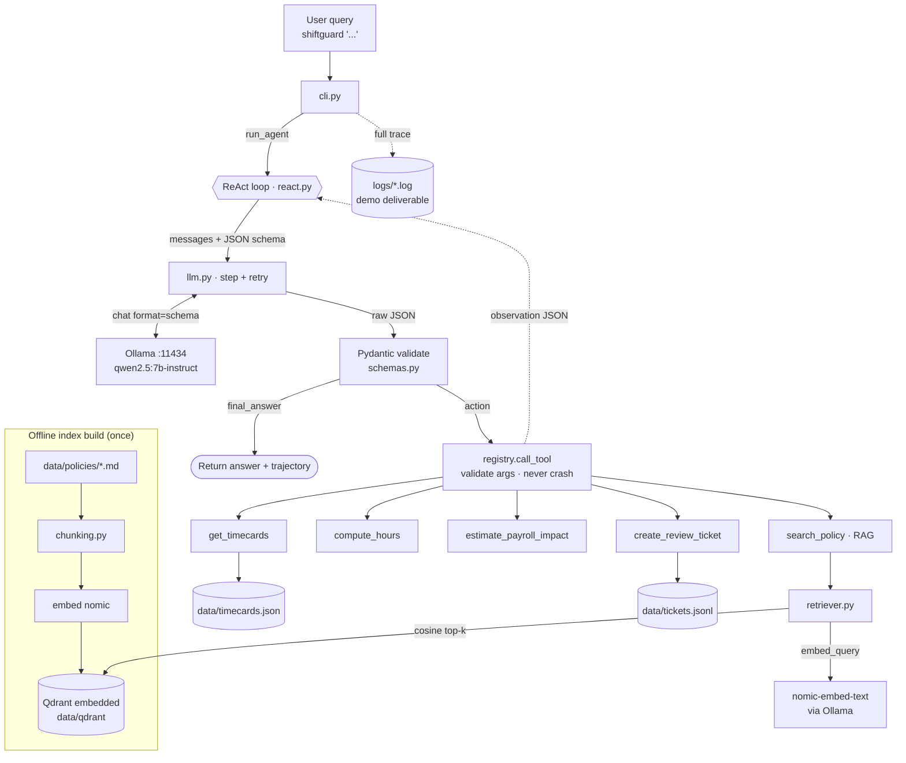

# ShiftGuard — Demo & Deep-Dive Guide

Everything you need to walk a grader through ShiftGuard: the architecture, *why*
each choice was made, the exact input→output of every tool, a full end-to-end
trace, and a terminology cheat-sheet to speak from confidently.

> **60-second pitch:** ShiftGuard is a fully-local action agent that audits
> hourly timecards before payroll. A small local LLM (Qwen2.5-7B on Ollama)
> *plans, routes, and explains*; all math and side-effects are done by
> deterministic Python tools. It retrieves payroll policy via RAG, computes
> hours/overtime, estimates dollar impact, and opens a manager review ticket —
> deciding autonomously when to retrieve vs. compute vs. act, with no
> hard-coded triggers. No cloud APIs.

---

## 1. System architecture

```
                                  YOUR MACHINE (no cloud, no network egress)
┌─────────────────────────────────────────────────────────────────────────────────────────┐
│                                                                                           │
│   $ shiftguard "Audit Maria's week..."                                                    │
│            │                                                                              │
│            ▼                                                                              │
│   ┌──────────────────┐     writes full trace      ┌─────────────────────────────┐        │
│   │  cli.py          │ ─────────────────────────▶ │  logs/agent_<ts>.log        │        │
│   │  (argparse)      │                             │  (the DEMO DELIVERABLE)     │        │
│   └────────┬─────────┘                             └─────────────────────────────┘        │
│            │ run_agent(query)                                                             │
│            ▼                                                                              │
│  ┌─────────────────────────── ReAct LOOP  (agent/react.py) ────────────────────────────┐ │
│  │                                                                                      │ │
│  │   messages = [ system prompt + tool catalog ,  user query ,  ...scratchpad... ]      │ │
│  │            │                                                                         │ │
│  │            ▼                                                                         │ │
│  │   ┌──────────────────┐   chat(format=JSON schema)   ┌──────────────────────────┐    │ │
│  │   │  llm.py          │ ───────────────────────────▶ │  OLLAMA  :11434          │    │ │
│  │   │  step()+retry    │ ◀─────────────────────────── │  qwen2.5:7b-instruct     │    │ │
│  │   └────────┬─────────┘     one JSON AgentStep        └──────────────────────────┘    │ │
│  │            │                                                                         │ │
│  │            ▼  Pydantic validate (schemas.py): thought + (action XOR final_answer)    │ │
│  │            │                                                                         │ │
│  │     final_answer? ──────────────────────────────────────────────▶ RETURN            │ │
│  │            │                                                                         │ │
│  │     action │  call_tool(name, args)  (tools/registry.py: validate args, never crash) │ │
│  │            ▼                                                                         │ │
│  │   ┌──────────────────────────── 5 DETERMINISTIC TOOLS ───────────────────────────┐  │ │
│  │   │                                                                               │  │ │
│  │   │  get_timecards ──────▶ data/timecards.json                                    │  │ │
│  │   │  compute_hours ──────▶ pure Python math (rounding, OT tiers)                  │  │ │
│  │   │  estimate_payroll_impact ─▶ pure Python math ($)                              │  │ │
│  │   │  create_review_ticket ────▶ append data/tickets.jsonl   (the only ACTION)     │  │ │
│  │   │                                                                               │  │ │
│  │   │  search_policy ─┐                                                             │  │ │
│  │   └─────────────────┼───────────────────────────────────────────────────────────┘  │ │
│  │                     ▼  (RAG: just another tool)                                      │ │
│  │       ┌───────────────────────────────────────────────────────────┐                 │ │
│  │       │  retriever.py → embed_query (nomic-embed-text via OLLAMA)   │                 │ │
│  │       │              → QDRANT (embedded, data/qdrant/) cosine top-k │                 │ │
│  │       └───────────────────────────────────────────────────────────┘                 │ │
│  │            │ observation (compact JSON) appended to scratchpad                        │ │
│  │            └────────────────── loop until final_answer / guardrail ──────────────────┘ │
│  └──────────────────────────────────────────────────────────────────────────────────────┘│
│                                                                                           │
│   OFFLINE INDEX BUILD (run once):  python -m shiftguard.rag.index                         │
│   data/policies/*.md ─▶ chunking.py ─▶ embed (nomic) ─▶ QDRANT collection "policies"       │
└─────────────────────────────────────────────────────────────────────────────────────────┘
```



---

## 2. Why each piece is what it is

Top-down. Each row is a decision and the reason behind it — this is your demo ammunition.

### Layer 0 — Everything is local
The LLM (Ollama), the vector store (Qdrant), and the orchestration all run on one
machine; no cloud calls. **Why:** a hard requirement of the brief, the demo works
offline once models are pulled, and *payroll* data never leaves the box.

### Layer 1 — Runner: Ollama
Single-binary local model server on `localhost:11434`. **Why:** named in the
brief; trivial install; and it gives us the two features we lean on hardest —
**structured outputs** (constrain generation to a JSON schema via `format`) and
native tool-calling. Rejected: vLLM (needs GPU), raw llama.cpp (too low-level),
LM Studio (GUI-first).

### Layer 2 — Model: `qwen2.5:7b-instruct` (Q4); `3b` for dev
**Why:**
- **Reliability over speed, because reliability compounds.** A ReAct loop is a
  chain: 95%/step → only ~66% over 8 steps. Qwen2.5-7B is best-in-class for
  tool-calling/instruction-following in the small class.
- **The demo is a log file, not a latency-bound UI** → correctness beats speed.
- **Not 14B even though 24GB fits it:** on CPU the bottleneck is memory
  *bandwidth*, not RAM *capacity*; a 14B halves tok/s and makes the loop
  impractical. Measured **~9.75 tok/s** on the 7B → ~2–4 min for the headline.
- Swappable via `OLLAMA_MODEL` with zero code change.

### Layer 3 — Correctness knobs: `num_ctx=8192`, `temperature=0.0`
- **`num_ctx`:** Ollama defaults context to **2048 and silently truncates the
  oldest tokens on overflow** — which would quietly delete the system prompt or
  early observations and corrupt the loop. Pinning 8192 is a *correctness* fix.
- **`temperature=0`:** deterministic, rule-following, repeatable runs.

### Layer 4 — RAG: embedded Qdrant + nomic-embed-text + heading-aware chunking
- **Qdrant embedded** (`QdrantClient(path=...)`, no Docker): real Qdrant,
  zero-ops, file-backed. It holds a **file lock** → one client per path → the
  retriever is a cached singleton.
- **`nomic-embed-text` via Ollama** (not `bge-small`/fastembed): keeps the stack
  on one runner and dodges `onnxruntime` wheel risk on Python 3.13/3.14. It's
  **asymmetric**, so we prefix `search_document:` on chunks and `search_query:`
  on queries — an A/B on our corpus flipped "forgot to clock out" from a #2 tie
  to a clean #1, at zero cost.
- **Heading-aware chunking** (one chunk per `##` rule, with `doc`/`section`
  metadata): each chunk is a self-contained rule → better retrieval + a clean
  **citation**. Long sections fall back to sentence boundaries, never blind cuts.

### Layer 5 — Agent: hand-rolled ReAct + structured JSON
- **No framework.** A ~150-line loop is transparent and *is* the autonomy logic
  being graded; a framework would hide it and bloat context for a small model.
- **Structured JSON every step** (`thought` + `action` XOR `final_answer`),
  schema-constrained by Ollama and validated by Pydantic — keeps ReAct's
  transparent reasoning without brittle free-text parsing.
- **RAG is just another tool.** No `if "overtime" in query` anywhere; routing is
  the model's choice from tool descriptions alone. *This is the autonomy criterion.*

### Layer 6 — Five deterministic tools (all math/side-effects)
**Why deterministic Python, never the LLM:** the brief mandates it, and it's
correct engineering — you unit-test `40.25h` and `$2.81` with exact assertions,
which you can't do to a probabilistic model. Single-responsibility tools are also
easier for a small model to call correctly than one mega-tool.

### Layer 7 — Guardrails & error handling
- **`extra="forbid"` on tool args:** a mis-named arg becomes a recoverable
  `invalid_arguments` observation instead of being silently dropped (which once
  produced a plausible-but-wrong **$0** estimate).
- **`call_tool` never raises:** failures return structured error dicts fed back
  as observations → the agent recovers instead of crashing.
- **Max-step budget + repeated-action detector:** stop runaway loops.
- **Bounded JSON-retry:** invalid output is re-prompted with the error (~2×).

---

## 3. Exact input → output for every tool

Memorize the *shape*, not the digits.

### `get_timecards`
**Input:** `{"employee": "Maria"}` *(omit dates unless the user names them)*
**Output (success):**
```json
{
  "pay_period": {"start": "2026-05-18", "end": "2026-05-22"},
  "employees": [{
    "id": "E001", "name": "Maria Sanchez", "hourly_rate": 22.5,
    "overtime_authorization": "unknown",
    "shifts": [
      {"date": "2026-05-18", "clock_in": "08:00", "clock_out": "18:30", "unpaid_break_min": 30},
      {"date": "2026-05-22", "clock_in": "08:00", "clock_out": null,    "unpaid_break_min": 30}
    ]
  }]
}
```
**Output (failure-recovery path):**
```json
{"error": "no employee matching 'Bob'", "available_employees": ["Maria Sanchez", "James Okafor"]}
```

### `search_policy` (the RAG tool)
**Input:** `{"query": "overtime authorization manager approval"}`
**Output:** top-k list, each with the **citation** the model may quote:
```json
[
  {"citation": "Overtime Policy > Overtime Authorization", "source": "overtime.md", "score": 0.771,
   "text": "Overtime Policy > Overtime Authorization\n\nAll overtime must be authorized by a manager in advance. Overtime that was worked but not pre-authorized is still paid, but it must be flagged for manager review..."},
  {"citation": "Overtime Policy > Overtime Threshold", "source": "overtime.md", "score": 0.74, "text": "..."}
]
```

### `compute_hours` (all hours math)
**Input:** `{"shifts": [ ...the 5 shift objects from get_timecards... ]}`
**Output:**
```json
{
  "per_shift": [
    {"date": "2026-05-18", "worked_hours": 10.0,  "complete": true,  "rounding_applied": false},
    {"date": "2026-05-19", "worked_hours": 10.5,  "complete": true,  "rounding_applied": false},
    {"date": "2026-05-20", "worked_hours": 10.0,  "complete": true,  "rounding_applied": false},
    {"date": "2026-05-21", "worked_hours": 9.75,  "complete": true,  "rounding_applied": true},
    {"date": "2026-05-22", "worked_hours": null,  "complete": false, "rounding_applied": false}
  ],
  "total_hours": 40.25, "regular_hours": 40.0, "overtime_hours": 0.25, "double_time_hours": 0.0,
  "has_overtime": true, "all_shifts_complete": false,
  "flags": ["rounding_applied on 2026-05-21", "missed_clock_out on 2026-05-22"]
}
```

### `estimate_payroll_impact` (all money math)
**Input:** `{"hourly_rate": 22.5, "regular_hours": 40.0, "overtime_hours": 0.25}`
**Output:**
```json
{"regular_pay": 900.0, "overtime_pay": 8.44, "double_time_pay": 0.0, "gross_pay": 908.44, "overtime_premium": 2.81}
```
`overtime_premium` $2.81 = the extra half-rate on 0.25 OT hours — the number on the ticket.

### `create_review_ticket` (the only side effect)
**Input:**
```json
{"employee": "E001", "issue": "overtime worked without authorization, missed clock-out",
 "recommended_action": "Review/authorize OT; correct incomplete punch", "payroll_impact": 2.81,
 "citations": ["Overtime Policy > Overtime Authorization", "Timekeeping Policy > Missed Clock-Out"]}
```
**Output:**
```json
{"status": "created", "ticket_id": "TKT-29531b26", "path": ".../data/tickets.jsonl",
 "ticket": {"ticket_id": "TKT-29531b26", "created_at": "2026-05-28T20:49:11Z", "employee": "E001",
            "issue": "...", "payroll_impact": 2.81, "citations": ["..."], "status": "open"}}
```
The model may claim success only if it sees `"status": "created"` — the action-honesty rule.

### Error wrappers from `call_tool` (the recovery story)
```json
{"error": "unknown_tool",      "tool": "foo",                     "available_tools": ["..."]}
{"error": "invalid_arguments", "tool": "estimate_payroll_impact", "detail": "hourly_rate: Field required"}
{"error": "tool_error",        "tool": "...",                     "detail": "<exception text>"}
```

---

## 4. Full end-to-end trace (the headline demo)

Query: **"Audit Maria's week for overtime risk and open a manager review ticket if needed."**
Each step the model emits a JSON `AgentStep`; the loop appends an `OBSERVATION`.

```
STEP 1  {"thought":"I need Maria's actual punches first.","action":{"tool":"get_timecards","args":{"employee":"Maria"}}}
        OBSERVATION: {... 5 shifts, overtime_authorization:"unknown" ...}

STEP 2  {"thought":"Now compute her hours from those shifts.","action":{"tool":"compute_hours","args":{"shifts":[...]}}}
        OBSERVATION: {total_hours:40.25, overtime_hours:0.25, all_shifts_complete:false, flags:[missed_clock_out..., rounding...]}

STEP 3  {"thought":"She's over 40h and OT auth is unknown — I must check policy before applying it.","action":{"tool":"search_policy","args":{"query":"overtime authorization manager approval"}}}
        OBSERVATION: [{citation:"Overtime Policy > Overtime Authorization", text:"All overtime must be authorized..."}]

STEP 4  {"thought":"Quantify the dollar impact of the 0.25 OT hours.","action":{"tool":"estimate_payroll_impact","args":{"hourly_rate":22.5,"regular_hours":40.0,"overtime_hours":0.25}}}
        OBSERVATION: {overtime_premium:2.81, gross_pay:908.44}

STEP 5  {"thought":"Unauthorized OT + a missed clock-out warrant a manager ticket.","action":{"tool":"create_review_ticket","args":{"employee":"E001","issue":"...","payroll_impact":2.81,"citations":["Overtime Policy > Overtime Authorization","Timekeeping Policy > Missed Clock-Out"]}}}
        OBSERVATION: {status:"created", ticket_id:"TKT-29531b26"}

STEP 6  {"thought":"Ticket confirmed created; summarize for the manager.","final_answer":"A manager review ticket (TKT-29531b26) was opened for unauthorized overtime and a missed clock-out. Overtime premium is $2.81. (Overtime Policy > Overtime Authorization)"}
```

**Talking point:** the same loop and prompt handle all five query categories —
only the query changes, yet the trajectory changes correctly. Nothing hard-codes
this sequence; the model even chose `compute_hours` before `search_policy` here,
a different order than we'd have written by hand. That's autonomous routing.

The five eval categories prove it systematically:

| Scenario | Query | Asserted trajectory |
|---|---|---|
| RAG-only | "What is our overtime threshold?" | `search_policy` only |
| Tool-only | "How many hours did Maria work on 2026-05-19?" | `get_timecards` → `compute_hours` |
| **Multi-step** | "Audit Maria's week … open a ticket if needed." | all 5 tools |
| Out-of-scope | "What's the weather today?" | zero tools, polite refusal |
| Failure recovery | "How many hours did Bob Smith work?" | `get_timecards` → graceful "not found" |

---

## 5. Terminology cheat-sheet

### Agent / orchestration
- **Agent / action agent** — an LLM that doesn't just answer; it *acts* by calling tools in a loop until the task is done.
- **ReAct** — "Reason + Act." The model writes a **thought**, takes an **action** (tool call), reads the **observation**, repeats. Our `thought`/`action`/`final_answer` JSON is ReAct.
- **Autonomous routing / no hard-coded triggers** — the model picks tools from descriptions alone; no `if keyword` logic. *The autonomy criterion.*
- **Scratchpad** — the running message history (thoughts + observations) the model sees each step.
- **Guardrails** — max-step budget, repeated-action detector, bounded retries.
- **Trajectory** — the ordered list of tools that fired; evals assert on this, not on wording.

### LLM internals
- **Tokens / tokens-per-second** — models read/write in tokens (~¾ word). ~9.75 tok/s on CPU.
- **Context window / `num_ctx`** — tokens the model can see at once; pinned 8192 (Ollama defaults to 2048 and silently truncates).
- **KV cache** — cached attention state that makes each next token cheap; sits in RAM with the weights.
- **Quantization / Q4_K_M** — 4-bit weights so a 7B fits in ~4.7GB with minimal quality loss.
- **Temperature** — randomness knob; **0.0** for deterministic, rule-following output.
- **System prompt / few-shot** — the always-present rules + tool catalog, and the worked example(s) teaching the output format.
- **Hallucination / grounding** — inventing facts vs. answering only from retrieved/tool data; our rules force grounding ("retrieve before you cite").

### RAG / retrieval
- **RAG (Retrieval-Augmented Generation)** — fetch relevant docs and feed them to the model so answers are grounded in *your* data.
- **Embedding** — text turned into a vector capturing meaning.
- **Vector store / Qdrant** — a DB that stores embeddings and finds nearest neighbors fast.
- **Cosine similarity** — the distance metric; closeness of two vectors' directions = semantic closeness.
- **Semantic search** — matching by meaning, not keywords.
- **Chunking** — splitting docs into retrievable pieces (one per policy rule).
- **top-k** — return the k best matches (we use 3).
- **Asymmetric embeddings / `search_document:` `search_query:`** — nomic was trained so queries/documents take different prefixes; matching that shape improves ranking.
- **Citation** — the `Doc > Section` string returned per chunk; the model may quote *only* these.

### Structured output / validation
- **Structured output / constrained decoding / grammar** — forcing generation to match a JSON schema (Ollama's `format`).
- **JSON Schema** — the output contract (we pin `args` to an object and `tool` to an enum of real tool names).
- **Pydantic** — validates parsed JSON; enforces "exactly one of action/final_answer."
- **`extra="forbid"`** — reject unknown arg names so mistakes surface as recoverable errors, not silent wrong answers.
- **Structured error / graceful recovery** — failures returned as `{"error": ...}` fed back as observations; the loop never crashes.

### Domain (payroll)
- **7-minute rule / quarter-hour rounding** — punches round to :00/:15/:30/:45; 1–7 min past rounds down, 8–14 rounds up.
- **Overtime tiers** — regular ≤40h, overtime 40–60h (×1.5), double-time >60h (×2.0).
- **Overtime premium** — the *extra* cost above straight time (what the ticket flags); 0.25h × $22.50 × 0.5 = **$2.81**.
- **Missed clock-out** — a shift with no end punch; policy forbids auto-estimating, so it's flagged.
- **JSONL** — one JSON object per line; append-friendly (why tickets use it).

### Infra / engineering
- **Idempotent index build** — deterministic `uuid5` point ids → re-indexing overwrites the same points, no duplicates.
- **Singleton + file lock** — embedded Qdrant allows one client per path, so `get_retriever()` is a cached single connection.
- **Editable install (`pip install -e`)** — links `src/` so edits take effect without reinstalling.

---

## 6. Demo run order

1. Show the **architecture diagram** (§1) — frames the whole system in 30s.
2. Run the headline live: `shiftguard "Audit Maria's week for overtime risk and open a ticket if needed."`
3. Open the generated **trace log** and walk the 6 steps (§4) — this shows autonomy + grounding.
4. Show `data/tickets.jsonl` — the real side-effect.
5. Run `python evals/run_evals.py` (or show `evals/report/summary.md`) — **5/5**, proving routing across categories.
6. Keep the **terminology sheet** (§5) in your back pocket for Q&A.
