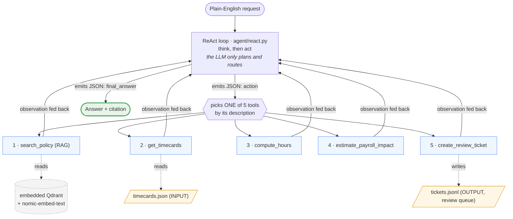
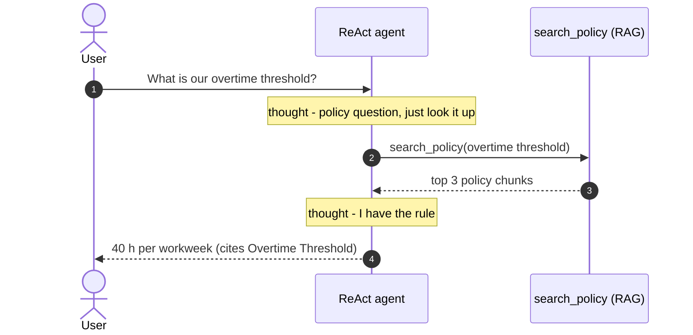
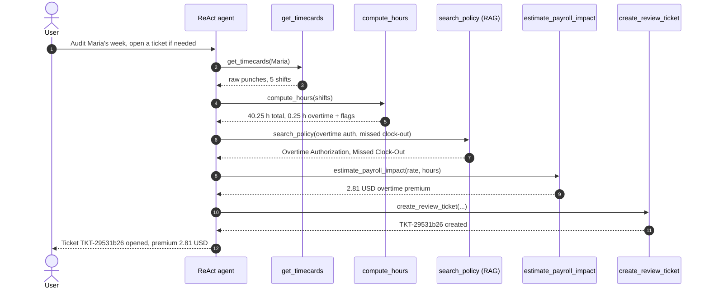

# ShiftGuard

ShiftGuard is a **fully-local AI action agent** that audits hourly employee timecards before payroll. Given a plain-English request, it looks up the relevant payroll policy via RAG, runs deterministic Python tools to detect issues (overtime, rounding, missed clock-outs), estimates the dollar impact, and opens a manager review ticket. It decides on its own when to look something up, when to calculate, and when to act.

No cloud APIs: the LLM, the vector store, and the orchestration all run on one machine. The LLM only **plans, routes, and explains**. Every calculation is done by tested Python, never by the model.

---

## What it demonstrates

- **Autonomous routing, no hard-coded triggers.** RAG is just another tool (`search_policy`); the model picks among all five tools from their descriptions alone. Same loop and prompt for every query, and only the tool path changes.
- **Tools own all math and side-effects.** Hours, rounding, overtime tiers, dollar amounts, and ticket creation live in deterministic, unit-tested functions.
- **Schema-constrained ReAct.** Each turn the model emits one JSON object: a `thought` plus either an `action` or a `final_answer`, validated with Pydantic and bounded by retries.
- **Real error handling.** A failed or mis-called tool returns a structured error that is fed back as an observation, so the agent recovers instead of crashing.

---

## High-level architecture

A request enters a loop. Each turn the model thinks, then either calls **one** tool or returns the final answer. The tool's result comes back as an observation and the loop repeats until the model is done.



Everything runs locally under **Ollama** (LLM + embeddings) with **embedded Qdrant**. Tickets append to `data/tickets.jsonl`, the local manager-review queue (no external notifications, by design).

**Each run, before you see an answer:** every model turn is schema-constrained and Pydantic-validated (bad JSON is retried); the loop caps steps and blocks repeated actions; tool errors come back as observations rather than crashes. The full trace is written to `logs/*.log`. The eval harness (below) is a separate offline test, not the live path.

---

## Two questions, two routes (the agent decides each one)

Both questions hit the **same loop, same prompt, same five tools**. Nothing about the path is scripted; the model reads the tool descriptions and chooses. The route differs only because the task does.

### Route A: a policy question (document lookup only)

> *"What is our overtime threshold?"*



**Answer:** Our overtime threshold is 40 hours per workweek (Monday 12:00 AM through Sunday 11:59 PM). Cited from *Overtime Policy > Overtime Threshold*.

**Path:** `search_policy -> final answer` &nbsp;(1 of 5 tools; no timecards, no math, no ticket)

### Route B: a full audit (document lookup *and* tool execution)

> *"Audit Maria's week for overtime risk and open a manager review ticket if needed."*
> This is the case that needs both a policy lookup and tool execution.



**Answer:** A manager review ticket (TKT-29531b26) was opened for overtime worked without authorization and a missed clock-out punch. Overtime premium: $2.81.

**Path:** `get_timecards -> compute_hours -> search_policy -> estimate_payroll_impact -> create_review_ticket -> final answer` &nbsp;(5 of 5 tools; RAG lookup *and* tool execution)

Note the discipline in Route B: every number ($2.81, 40.25 h) comes from a Python tool, never the model; every citation is one `search_policy` actually returned; and the ticket is reported as created only because the observation confirmed it.

---

## Stack and why each piece was chosen

| Choice | What | Why this one |
|---|---|---|
| **Runner** | Ollama | One local binary serves both the LLM and the embeddings, and constrains output to a JSON schema natively, which the ReAct loop relies on. |
| **LLM** | `qwen2.5:7b-instruct` (dev: `:3b`) | Strong instruction-following and native function-calling at the 7B size (tracked on the Berkeley Function-Calling Leaderboard). In a multi-step loop one bad step derails the rest, so per-step reliability matters more than tokens/sec. Swappable via `OLLAMA_MODEL`. |
| **Why not 14B** | n/a | CPU token generation re-reads every weight per token, so it is bound by memory bandwidth: a 14B moves ~2x the bytes and runs at ~half the speed. Too slow for a 5-6 step loop. |
| **Vector store** | Qdrant **embedded** | The same Qdrant engine as the server, run in-process from a file path: real ANN search, zero ops, no Docker. |
| **Embeddings** | `nomic-embed-text` via Ollama | Runs on the same Ollama runner (no extra ML dependencies). It is task-prefixed: queries are embedded as `search_query:` and policy chunks as `search_document:`, which is how it was trained and helps asymmetric RAG (short question vs long rule). |
| **Chunking** | One chunk per policy rule | Split on headings so each vector is a complete, citable rule carrying `doc`/`section` metadata. Fixed-size cuts would split a rule across chunks and break citations. |
| **Agent** | Hand-rolled ReAct | ~150 lines of explicit loop. The autonomy logic is what is being evaluated, so it stays visible rather than buried in a framework that also bloats context for a small model. |
| **Context window** | Pinned `num_ctx=8192` | Ollama defaults to 2048 and, on overflow, silently drops the oldest tokens (the system prompt and early observations) with no error, quietly corrupting the loop. 8192 holds the whole trajectory. |

---

## Prompt robustness and error handling

Each of these targets a failure actually observed while running the agent:

- **Structured output, validation, retry.** Ollama's `format` constrains output to the step schema; Pydantic enforces "exactly one of action / final_answer"; invalid JSON is re-prompted with the error.
- **Strict tool args.** A mis-named argument surfaces as a recoverable error instead of being silently dropped (which had once produced a plausible-but-wrong $0 estimate).
- **Anti-hallucination.** The model must `search_policy` before citing a rule, and may cite only the exact strings the tool returned.
- **Action honesty.** It claims success only when the observation confirms it (e.g. a ticket marked `created`); otherwise it retries or reports the failure.
- **Loop safety.** Max-step budget, a repeated-action detector, and tool exceptions caught and returned as structured errors.

---

## Run it

Needs **Python 3.13** and a running **Ollama**. No Docker, no cloud account.

```bash
py -3.13 -m venv .venv
.venv\Scripts\activate                  # macOS/Linux: source .venv/bin/activate
pip install -e ".[dev]"

ollama pull qwen2.5:7b-instruct         # pulled once, cached, works offline after
ollama pull nomic-embed-text

python -m shiftguard.rag.index          # build the embedded-Qdrant policy index

shiftguard "Audit Maria's week for overtime risk and open a ticket if needed."
shiftguard "What is our overtime threshold?"
```

Tests and evals: `pytest tests/test_tools.py tests/test_chunking.py` (fast, no LLM), `python evals/run_evals.py` (full agent, 5/5 passing), `pytest tests/test_routing.py` (live-LLM mirror; skips if Ollama is down). Config is via `.env` (see `.env.example`); every setting has a safe default.

---

## Project layout

```
src/shiftguard/
├── cli.py               # shiftguard "<query>"
├── config.py            # settings (env/.env, safe defaults)
├── logging_setup.py     # full trace -> console + run file
├── rag/                 # chunking.py, index.py, retriever.py   (RAG / search_policy)
├── tools/               # timecards.py, compute.py, tickets.py, registry.py
└── agent/               # schemas.py, prompts.py, llm.py, react.py   (the ReAct loop)
data/   policies/*.md (RAG corpus), timecards.json, tickets.jsonl (generated)
evals/  scenarios.jsonl, run_evals.py, report/
tests/  test_tools.py, test_chunking.py, test_routing.py
```

---

## Considered and rejected

- **LangChain / LlamaIndex / CrewAI:** would hide the autonomy logic and bloat context for a small CPU model.
- **Docker Qdrant:** embedded mode is real Qdrant with zero ops.
- **14B model:** CPU is bandwidth-bound; too slow for the loop.

## Known limitations

- **Speed:** CPU-only is about 9 tok/s on the 7B, so roughly 2 to 5 minutes for the multi-step audit (the only working inference path on the target hardware).
- **Small-model variance:** multi-step coherence on a 7B is at the edge. Structured output, strict arg schemas, retries, and the repeated-action and max-step guards are the mitigations, and the eval measures the trajectory directly.
</content>
