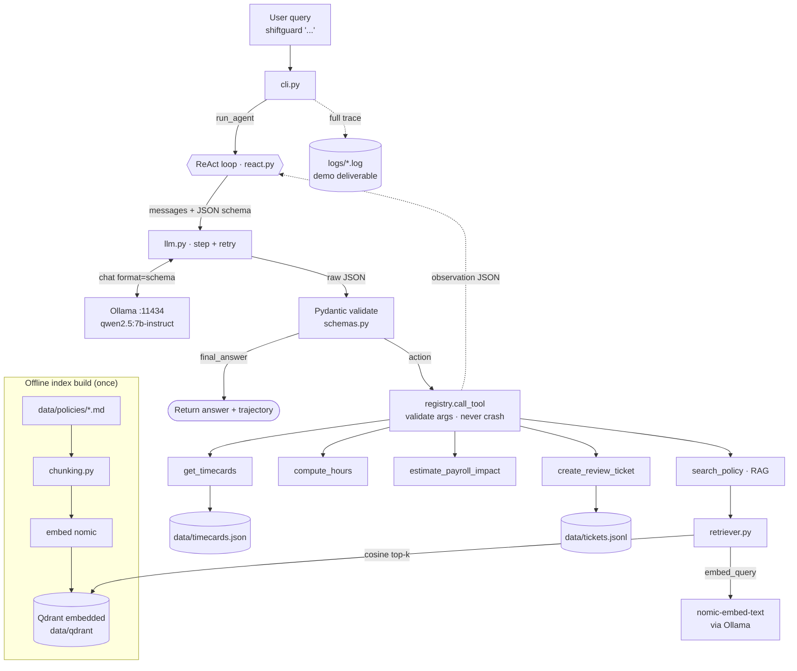

# ShiftGuard

ShiftGuard is a **fully-local AI action agent** that audits hourly employee timecards before payroll. Given a natural-language request, it retrieves payroll policy via RAG, runs deterministic Python tools to detect issues (overtime, rounding, missed clock-outs), estimates the dollar impact, and opens a manager review ticket — deciding **autonomously** when to retrieve, compute, or act. No cloud APIs: the LLM, the vector store, and the orchestration all run on one machine.

The LLM only **plans, routes, and explains**. Every calculation is performed by deterministic Python — the model never does arithmetic.

---

## What it demonstrates

- **Agentic routing with no hard-coded triggers.** RAG is exposed as just another tool (`search_policy`); the model chooses among all five tools purely from their descriptions. The same loop and prompt handle every query category — only the query changes, yet the tool trajectory changes correctly.
- **Deterministic tools own all math and side-effects.** Hours, rounding, overtime tiers, dollar amounts, and ticket creation live in tested Python functions.
- **Schema-constrained ReAct.** Each step the model emits a single JSON object (`thought` + either an `action` or a `final_answer`), validated with Pydantic and bounded by retries.
- **Real error handling.** Failed/mis-called tools return structured errors that are fed back as observations so the agent recovers instead of crashing.

---

## Architecture

```
                ┌───────────────────────── ReAct loop (agent/react.py) ─────────────────────────┐
  user query ──▶│  system prompt + tool catalog + scratchpad                                     │
                │            │                                                                    │
                │            ▼  Ollama structured output (format=JSON schema)                     │
                │   AgentStep {thought, action | final_answer}  ── Pydantic validate + retry      │
                │            │                                                                    │
                │     action │  registry.call_tool(name, args)  ── Pydantic arg schema (forbid)   │
                │            ▼                                                                     │
                │   ┌────────────────────────── 5 deterministic tools ───────────────────────┐   │
                │   │ get_timecards · search_policy(RAG) · compute_hours ·                    │   │
                │   │ estimate_payroll_impact · create_review_ticket                          │   │
                │   └─────────────────────────────────────────────────────────────────────────┘  │
                │            │ observation (compact JSON, fed back)                              │
                │            └──────────────── loop until final_answer / guardrail ──────────────┘
                └───────────────────────────────────────────────────────────────────────────────┘
                                     │
        local: Ollama (qwen2.5 + nomic-embed-text)   ·   embedded Qdrant   ·   trace log file
```

<details>
<summary>Same flow as a rendered diagram (GitHub renders Mermaid)</summary>



</details>

The full thought/action/observation trace is logged to a file per run (`logs/` for the CLI, `evals/report/` for the eval harness) — that trace **is** the demo deliverable. A deeper demo-prep walkthrough (per-tool I/O, an end-to-end trace, and a terminology cheat-sheet) lives in [`DEMO.md`](DEMO.md).

---

## Stack & key decisions

| Choice | What | Why |
|---|---|---|
| **Runner** | Ollama | Single-binary local install; mature native structured outputs (`format`) and tool-calling. |
| **LLM** | `qwen2.5:7b-instruct` (Q4), `qwen2.5:3b-instruct` for dev | Best small-model tool-calling/instruction-following. Reliability **compounds** across a multi-step loop, and the demo is a log file (not latency-bound), so correctness > speed. Swappable via `OLLAMA_MODEL`. |
| **Not 14B** | — | On CPU the bottleneck is memory **bandwidth**, not capacity; a 14B would roughly halve tok/s and make the loop impractical. |
| **Vector store** | Qdrant **embedded** (`QdrantClient(path=...)`) | Real Qdrant, zero-ops, **no Docker**. One client per path (a process-wide singleton holds the connection). |
| **Embeddings** | `nomic-embed-text` via Ollama | Keeps the whole stack on one runner (no `onnxruntime`/`fastembed` wheels — relevant on Python 3.13/3.14). Uses nomic's asymmetric `search_document:` / `search_query:` prefixes (measurably better retrieval on this corpus). |
| **Chunking** | Heading-aware, one chunk per policy rule | Each chunk is a self-contained rule with `doc`/`section` metadata for citations; sentence-boundary fallback for long sections — never blind fixed-size cuts. |
| **Agent** | Hand-rolled ReAct + structured JSON | A ~150-line loop is transparent and demonstrates the autonomy logic directly. A framework (LangChain/CrewAI) would hide that logic, bloat context for a small CPU model, and obscure engineering quality. |
| **Tools** | 5 single-responsibility functions | Easier for a small model to call correctly; all math/side-effects isolated and unit-tested. |
| **Context** | Pinned `num_ctx=8192` | Ollama defaults to 2048 and **silently truncates** on overflow, which corrupts a multi-step loop. |

---

## Prompt robustness & error handling

These were hardened by running the real agent and watching it fail — each fix targets an observed failure:

- **Structured output + validation + retry.** Ollama’s `format` constrains output to the step schema (with `action.args` pinned to an object); Pydantic validates "exactly one of action/final_answer"; invalid JSON is re-prompted with the error (bounded retries).
- **Strict tool args (`extra="forbid"`).** A mis-named argument (e.g. `hours_worked` instead of the `regular/overtime/double_time` tiers) surfaces as a recoverable `invalid_arguments` observation instead of being silently dropped — which had produced a plausible-but-wrong **$0** payroll estimate.
- **Anti-hallucination.** The model must retrieve a policy rule with `search_policy` before applying or citing it, and may cite **only** the exact `citation` strings the tool returns (it must never invent citations, dates, or other tool arguments).
- **Action honesty.** It may claim an action succeeded only if the observation confirms it (e.g. a ticket with `status: "created"`); on a tool error it retries or reports the failure.
- **Loop safety.** Max-step budget, a repeated-action detector, and tool exceptions caught and returned as structured errors.

---

## Setup

Requires **Python 3.13** (3.14 lacks some wheels) and a running **Ollama**.

```bash
py -3.13 -m venv .venv
.venv\Scripts\activate            # Windows  (use: source .venv/bin/activate on macOS/Linux)
pip install -e ".[dev]"

# Pull the models once (cached locally; works offline thereafter)
ollama pull qwen2.5:7b-instruct
ollama pull nomic-embed-text

python -m shiftguard.rag.index    # build the embedded Qdrant policy index
```

Configuration is via environment / a local `.env` (see `.env.example`); every setting has a safe default. Run commands from the repo root.

## Usage

```bash
# End-to-end audit (writes a full trace to logs/ and appends data/tickets.jsonl)
shiftguard "Audit Maria's week for overtime risk and open a ticket if needed."

# Fast unit tests (exact math + chunk boundaries, no LLM)
pytest tests/test_tools.py tests/test_chunking.py

# Full eval harness — runs the agent over all categories, writes evals/report/
python evals/run_evals.py

# Integration mirror (slow; live LLM; auto-skips if Ollama is down)
pytest tests/test_routing.py
```

---

## Evals

`evals/run_evals.py` runs the **full agent** over labeled scenarios and asserts on the **tool trajectory** + answer properties (not exact wording); `tests/test_routing.py` mirrors it as pytest. Current result: **5/5 passing**.

| Scenario | Query | Asserted trajectory |
|---|---|---|
| RAG-only | "What is our overtime threshold?" | `search_policy` only; no compute/ticket tools |
| Tool-only | "How many hours did Maria work on 2026-05-19?" | `get_timecards` → `compute_hours` |
| **Multi-step** | "Audit Maria's week … open a ticket if needed." | `get_timecards` → `compute_hours` → `search_policy` → `estimate_payroll_impact` → `create_review_ticket` |
| Out-of-scope | "What's the weather today?" | zero tools, polite refusal |
| Failure recovery | "How many hours did Bob Smith work?" | `get_timecards` → graceful "not found", no crash |

The headline audit correctly finds Maria at **40.25h** (0.25h overtime + a missed clock-out + a rounding flag), estimates a **$2.81** overtime premium, and opens a manager review ticket grounded in the *Overtime Authorization* policy.

---

## Project layout

```
src/shiftguard/
├── config.py            # pydantic-settings (env/.env, safe defaults, path resolution)
├── logging_setup.py     # structured trace -> console + run file
├── cli.py               # `shiftguard "<query>"`
├── rag/
│   ├── chunking.py      # heading-aware chunker
│   ├── index.py         # Ollama embeddings + embedded Qdrant (build/load)
│   └── retriever.py     # search_policy backend (top-k + citations)
├── tools/
│   ├── timecards.py · compute.py · tickets.py   # the deterministic tools
│   └── registry.py      # name -> (description, Pydantic arg schema, fn) + call_tool
└── agent/
    ├── schemas.py · prompts.py · llm.py · react.py   # ReAct loop + structured output
data/        policies/*.md (RAG corpus) · timecards.json · tickets.jsonl (generated)
evals/       scenarios.jsonl · run_evals.py · report/
tests/       test_tools.py · test_chunking.py · test_routing.py
```

---

## Considered & rejected

- **LangChain / LlamaIndex / CrewAI** — would hide the autonomy logic being graded and bloat context for a small CPU model.
- **Docker Qdrant** — embedded mode is real Qdrant with zero ops; Docker stays an optional note.
- **14B model** — CPU is bandwidth-bound; too slow for the loop.
- **fastembed / `bge-small`** — `onnxruntime` wheel availability on Python 3.13/3.14; embedding via Ollama removes the dependency.

## Known limitations

- **Speed:** CPU-only ~9 tok/s on the 7B → ~2–5 min for the multi-step audit. This is the only working inference path on the target hardware (iGPU/NPU unsupported by Ollama today).
- **Retrieval near-duplicate:** "overtime threshold" can rank *Double Time* just above *Overtime Threshold* (both share the phrase "40-hour overtime threshold"); `top_k=3` still surfaces the right rule. Fixable content-side if needed.
- **Small-model variance:** multi-step coherence on a 7B is at the edge; structured output, strict arg schemas, retries, and the repeated-action/max-step guards are the mitigations, and the eval measures the trajectory directly.
